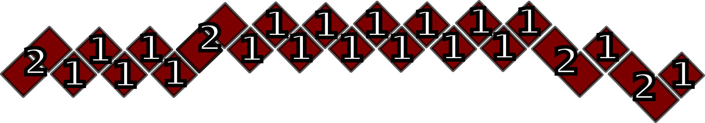

# Cubra-Solver
<h1>Java Program to solve Cubra / Snake Cube Puzzle</h1>

Little program I wrote to solve a Cubra-Cube / Snake-Puzzle-Cube.
Wasn't able to solve it myself and couldn't find any solution to my particular version of the cube. 
The Program defines a 3x3x3 'Field' in which the snake has to fit. It simply brute-forces every possible
move from every possible starting-position within the field. If you  have a different cube you need to 
change the 'private int[] snake' variable to correspond to your snake. The first section has to have 
a length of two for this program (The first two pieces are set manually before starting the recursion 
for the rest). Otherwise you would have to adjust the startPlacing() function. Every number in the 
snake-array denotes how many pieces there are until the next "turn". That's why the sections which 
have a length of 3 are denoted with 2s here, because the first of the three is already placed by the 
previous function call. 

Figure 1 shows my specific cube and the corresponding array.

<b>Figure 1</b>

